# Engineering Thesis

## "Web system supporting product catalog management and client queries"

This project was created for [REED](https://reed.kalisz.pl/) company that specializes in comprehensive printing and advertising services.
They needed a web-based system designed to support product catalog management and handle customer inquiries. It consists of two main components: a public-facing website and an admin panel.

The system addresses the limitations of the client's existing solution, such as slow loading times, a cumbersome administrative interface, and the lack of personalized price calculators. The new system is tailored to the client's needs, with some key improvements:

- much more productive pricing panels,
- simpler menu, category and file management,
- less cluttered, more intuitive product display,
- streamlined inquiry form.

### The Public Website

The public website enables customers to browse products, view detailed information, and submit inquiries. A simple menu was provided that allows to gradually expand nested categories, thus filtering the products.

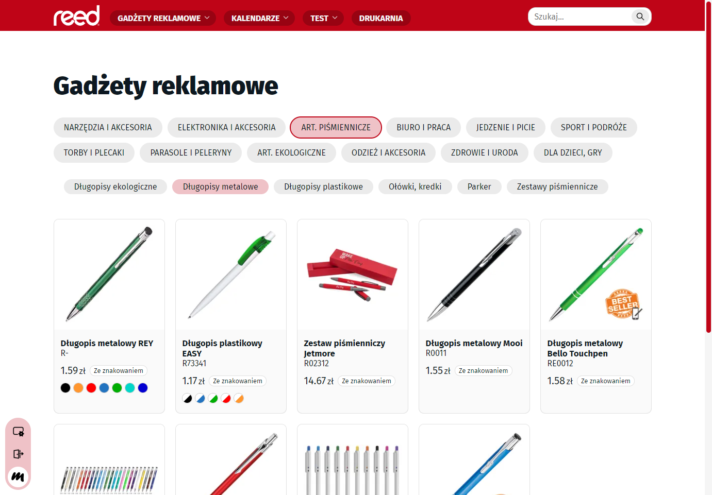

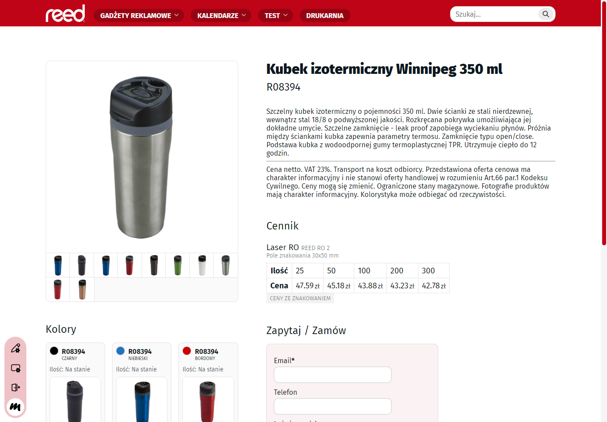

### The Admin Panel

The admin panel was built to manage calculators, products, colors, categories, menus, pages, customer inquiries, and some distinct website fragments. It includes features like hierarchical category and menu organization, handling images and files, but most importantly **automated price calculators**, which significantly improve workflow efficiency. Administrators can easily adjust pricing of multiple sets of products based on customizable calculators based on arbitrary parameters.

#### Content Management

The management of products, colors, categories, menus, pages and certain website fragments all happens in visually similiar panels. Products can be assigned to multiple categories and colors. You can also upload images and files.

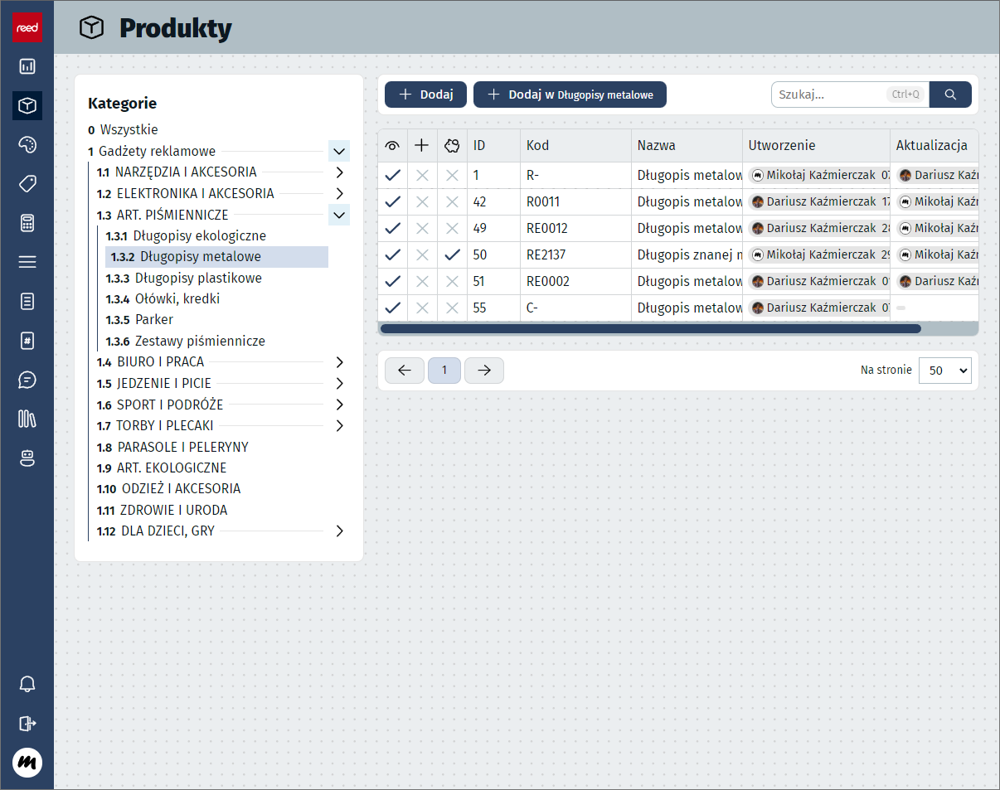

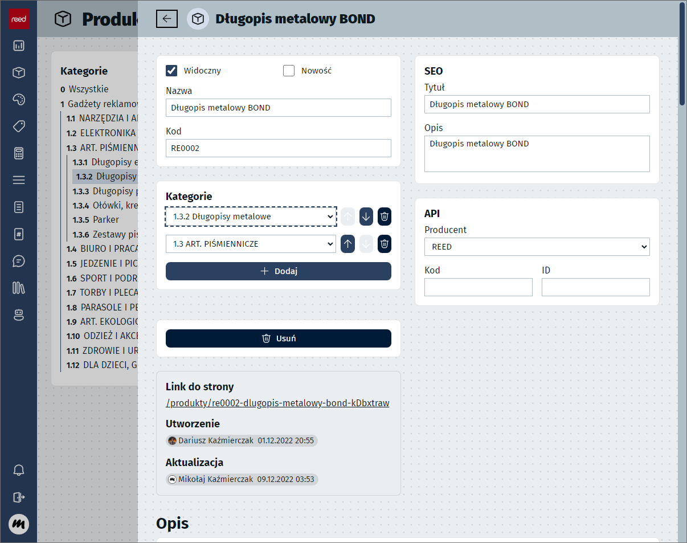

  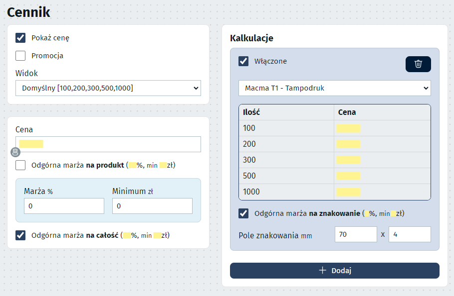

  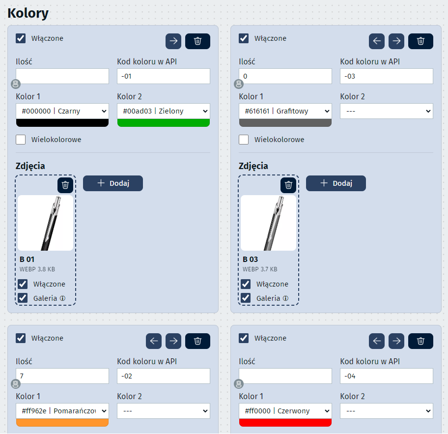

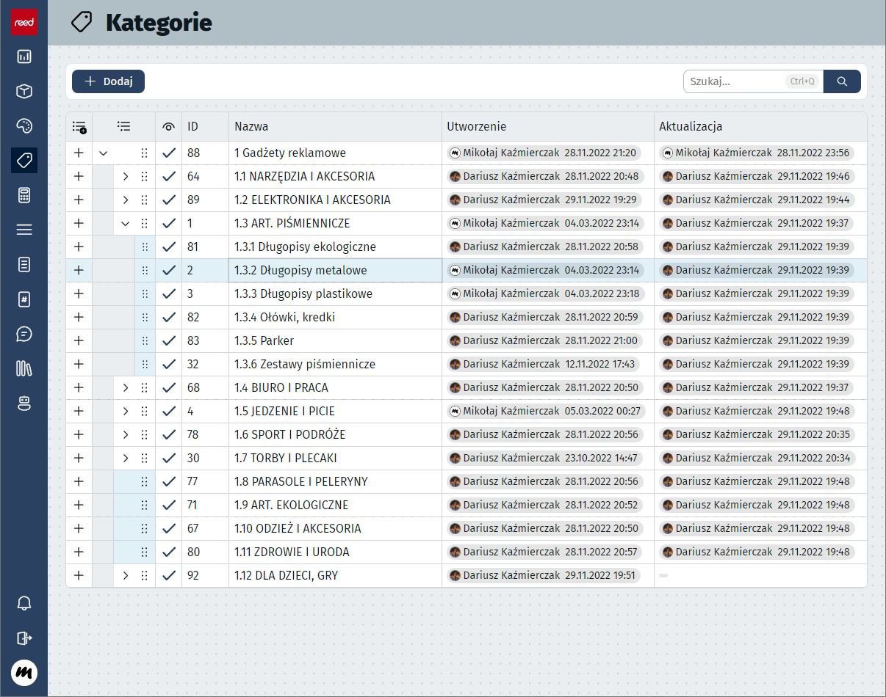

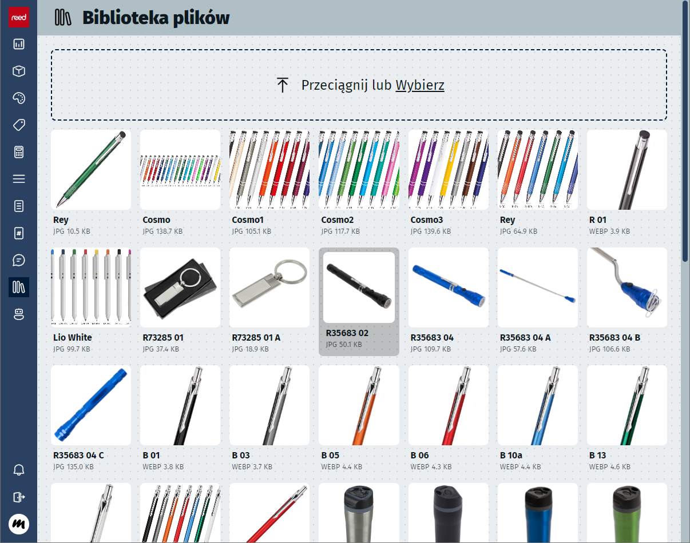

#### Inquiries

A section of the panel is dedicated to managing customer inquiries, as well as adding inquiries not directly submitted through the website.

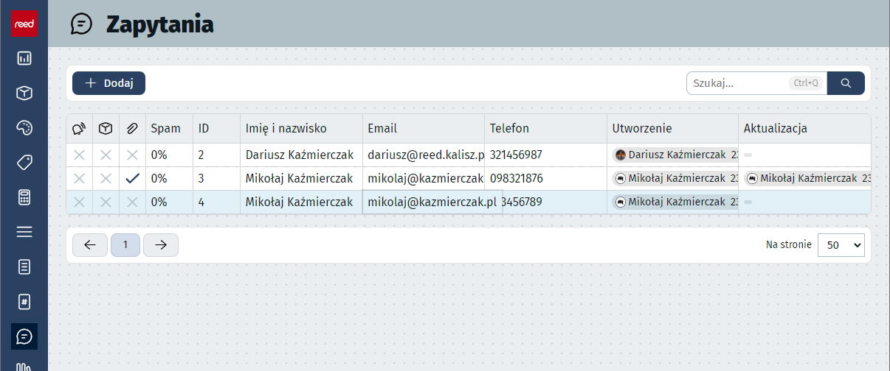

#### Calculators

Without a doubt, the most important feature of the admin panel is the **automated price calculators**. They significantly reduce the time spent on manual calculations and ensures consistent pricing in all products.

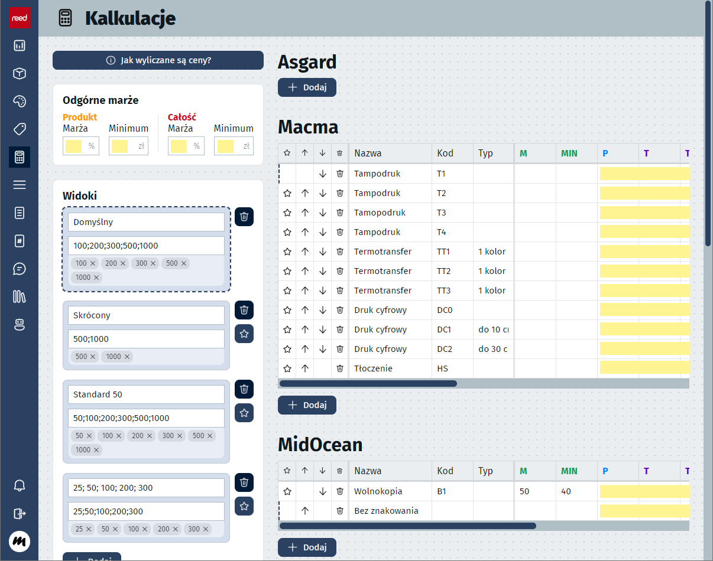

#### Development

The project was developed using agile methodology, with iterative feedback from the client ensuring the system met their expectations.

Technologically, the project leverages Directus (a Backend-as-a-Service solution) for database and API management, ensuring scalability and ease of maintenance. The frontend is built using SvelteKit, chosen for its performance and developer-friendly approach. WebSockets were also introduced (via a custom server aptly named "Heimdall") to enable real-time updates for the admin panel.

Architecture Diagram | Use Case Diagram
-|-
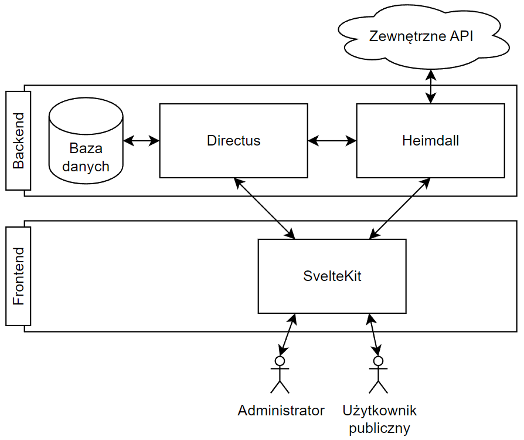 | 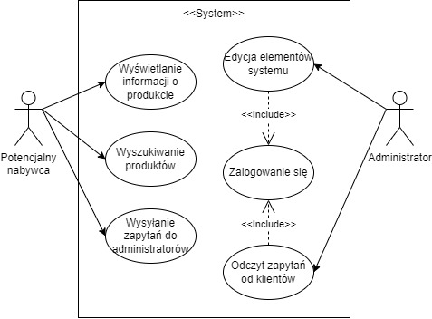

### Feedback and Results

Elementary usability tests confirmed the interface's intuitiveness, and performance benchmarks showed significant improvements over the old system. Adding a typical new product from scratch now takes 76 seconds compared to 442 seconds previously. Future enhancements will include automated price and inventory synchronization with external suppliers (via their APIs), scheduling tools for automatic product publication, and further UX improvements both in the admin panel and the public-facing website.

This project demonstrates my ability to deliver a comprehensive, real-world, customer-driven solution that combines technical expertise and a focus on user experience.

 

## `Develop 👨‍💻`

Both the public website and admin panel are statically generated. Powered by [SvelteKit](https://kit.svelte.dev/).\
The admin panel is using a REST API that runs as a node server. Powered by [Directus](https://directus.io/).

### Backend: <small>`/backend`</small>

#### 1. Directus: <small>`/backend/directus`</small>

Directus turns an SQL database into a REST API.

`npm run start`

#### 2. Heimdall: <small>`/backend/heimdall`</small>

Heimdall is a custom server that performs actions based on the information from the admin panel.

`npm run dev`

### Frontend: <small>`/frontend`</small>

`npm run dev`

 

## `Deploy 🏃`

Setup [nginx](https://nginx.org/).\
Consider running everything with [pm2](https://github.com/Unitech/pm2).

Serve SvelteKit on port **80**.\
Serve Directus on port **8055**.\
Serve Heimdall on port **999**.

#### Backend: <small>`/backend`</small>

1. Run Directus (<small>`npm run start`</small>)
2. Run Heimdall (<small>`npm run start`</small>)

#### Frontend: <small>`/frontend`</small>

Build (<small>`npm run build`</small>) and run the node server (<small>`node ./build`</small>).
